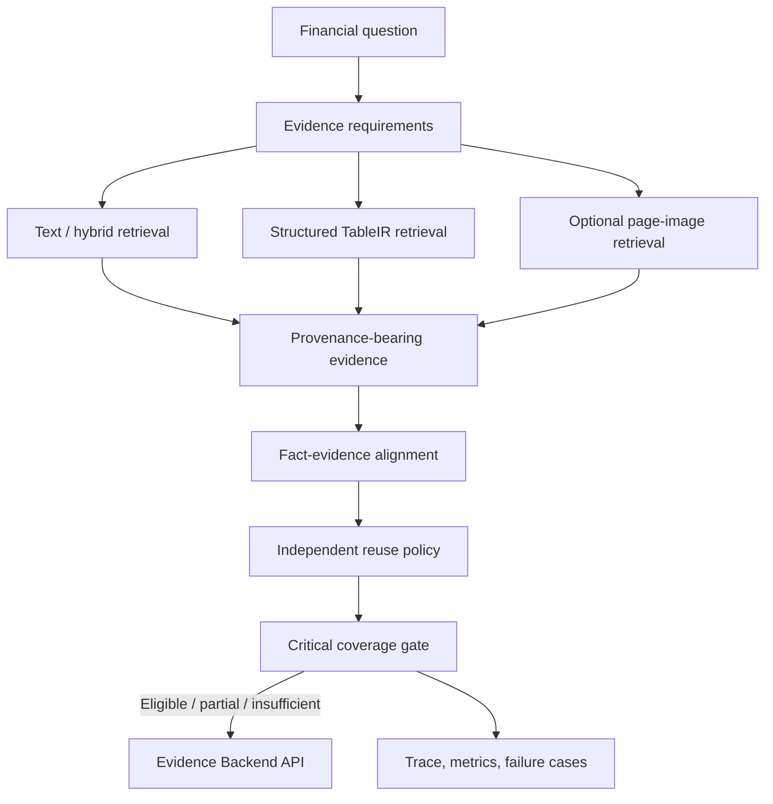

# FinEvidence

**Evidence-qualified retrieval for financial research.** FinEvidence is a research-grade financial RAG backend that treats retrieval relevance as a starting point—not proof that an answer is supported. It models required evidence, checks whether each critical requirement is independently satisfied, preserves source provenance, and exposes the result through a small API.

> **Core principle:** A system should answer only when it can show that every critical evidence requirement is supported by valid, role-correct evidence or a legitimate derivation.

This repository contains the implementation, frozen benchmark slices, evaluation reports, API contract, and OpenSpec changes. It is an experimental evidence backend—not a production banking deployment or a general-purpose chat application.

## Why it exists

Financial documents contain near-duplicate but materially different facts: different periods, entities, segments, metrics, reporting bases, units, and table contexts. A conventional “retrieve top-k, then ask an LLM” pipeline can return plausible evidence while missing a critical exception, mixing table rows, reusing one passage to support unrelated facts, or selecting a superseded value.

FinEvidence makes those failure modes explicit and measurable:

- represent evidence requirements and their dependencies;
- align candidate evidence to specific requirement roles and financial slots;
- prevent invalid evidence reuse from inflating completeness;
- distinguish retrieved facts from derived and explanatory facts;
- preserve document, page, table, row, column, and available geometry provenance;
- report failure traces and evidence sufficiency separately from answer generation.

## Retrieval and evidence flow



A retrieved page or a high similarity score does **not** by itself satisfy a requirement. Visual and table candidates continue through the same alignment and coverage checks.

## What is implemented

| Capability | Current implementation |
|---|---|
| Evidence representation | Typed, versioned evidence contracts with source and financial metadata |
| Requirement reasoning | Pydantic requirement DAG for retrieved, derived, explanatory, and context facts |
| Evidence qualification | Fact–evidence alignment, reuse policy, independent coverage, and critical-requirement gate |
| Retrieval | Reproducible CPU dense/hybrid baselines, bounded targeted retrieval, table-cell retrieval, and an optional CLIP RN50 page-image path |
| Table handling | Source-array TableIR plus bounded geometry-assisted PDF-to-TableIR extraction; semantic accuracy is not claimed without verified cell-level gold |
| API | Local FastAPI service for search, coverage, table query, claim verification, citation lookup, and health |
| Search control primitives | Bounded typed controller and an in-memory typed EvidenceGraph; not a full Agent loop or GraphRAG system |
| Evaluation | Frozen manifests, hashes, per-query traces, failure cases, retrieval/evidence metrics, and reproducibility artifacts |

## Measured results

Results below belong to distinct datasets and experiments; they are not a single leaderboard score.

| Experiment | Observed result | Interpretation |
|---|---|---|
| RealFinance-v1, 100 cases (50 TAT-QA + 50 FinQA) | Dense Recall@5 **0.0900**; Hybrid Recall@5 **0.1417** | Hybrid is the stronger measured baseline in this run |
| P0-G evidence qualification | D3 Raw Self-Coverage **1.0000** vs Independent CER **0.7283**; invalid reuse **0.4100** | Self-coverage can appear perfect while role-correct independent evidence is missing |
| HSBCNaturalMultimodal-v1, 80 cases | Recall@10: T0 **0.5375**, T1 Parsed Page Text **0.5875**, V0 CLIP **0.0750**, M1 **0.5625** | On this natural control set, the visual baseline did not beat text retrieval |
| B4.1 HSBC table slice, 60 cases | TableIR recovered **5 of 24** table-category page misses by @10 vs Parsed Page Text; bbox recoverability **0.7418** | Structure can help on table cases; semantic cell accuracy remains N/A without verified cell gold |
| B5.1, frozen RealFinance-v1 | Current Hybrid Recall@5 **0.1417**; Qwen3 metrics **N/A** | Qwen weights were unavailable, so no Qwen inference or quality claim is made |

The HSBC visual stress workload is project-created and has a documented construction bias; it is not an official HSBC benchmark. The 36-case RequirementAdjudicated-v1 subset is model-assisted adjudication, not human-verified gold. See the reports for scope, provenance, and limitations.

## Current project status

- **Evidence Backend v1:** callable local API and documented Agent integration boundary.
- **P0-H:** scoped requirement adjudication and HSBC natural hard-case experiment completed; annotations are not human-verified gold.
- **B3:** **PARTIAL**. The HSBC visual experiments are executable, but the frozen FinRAGBench-V page-image evaluation remains blocked by the required public PDF archive transfer.
- **B4 / B4.1:** scoped failure-aware retrieval and real HSBC TableIR experiments completed; this is not production hardening.
- **P0-J:** provenance-aware citation, table-semantics, and answerability evaluators exist; formal quality scores remain N/A where human-verified gold is absent.
- **B5.1:** **PARTIAL**. The optional Qwen embedding adapter and bounded controller boundary exist, but model weights were not obtained and Qwen inference was not run. Neural reranking, ColBERT-style late interaction, Qwen3-VL/ColQwen, and graph-backed retrieval are not claimed as completed experiments.

## Quick start

Requires Python **3.12+**.

```powershell
py -3.12 -m venv .venv
.\.venv\Scripts\python.exe -m pip install -e '.[dev]'
.\.venv\Scripts\python.exe -m pytest -q
```

The core install is sufficient for the CPU fixture and API contracts. Install
the optional PDF/visual dependencies only when those experiments are needed:

```powershell
.\.venv\Scripts\python.exe -m pip install -e '.[pdf,visual]'
```

For the fully pinned project environment, install `requirements.txt` instead;
it includes the heavier PyTorch/Transformers stack.

Run the small CPU regression fixture:

```powershell
.\.venv\Scripts\python.exe -m finevidence.eval.run --config configs/mini_cpu.json
```

Start the local Evidence Backend:

```powershell
.\.venv\Scripts\python.exe -m uvicorn finevidence.api.app:app --host 127.0.0.1 --port 8000
```

Then open [health](http://127.0.0.1:8000/health) or the interactive API docs at [http://127.0.0.1:8000/docs](http://127.0.0.1:8000/docs).

The service does not generate investment advice or final answers. It returns evidence, coverage, verification, and citation data for a consuming application.

## Reproduce selected experiments

Run commands from the repository root. Use a fresh output directory for each run; formal runners preserve configs and manifests with their outputs.

```powershell
# RealFinance-v1 baseline
.\.venv\Scripts\python.exe -m finevidence.eval.p0_d --config configs/p0_d_cpu.json

# Requirement graph and evidence qualification
.\.venv\Scripts\python.exe -m finevidence.eval.p0_g --config configs/p0_g_cpu.json

# HSBC requirement and natural hard-negative evaluation
.\.venv\Scripts\python.exe -m finevidence.eval.p0_h --config configs/p0_h_cpu.json

# B5.1 bounded retrieval experiment
.\.venv\Scripts\python.exe scripts/run_b5.py --stage b5.1 --config configs/b5_1_cpu.json
```

Some experiments require local HSBC PDFs, rendered pages, or model weights. These are not bundled; consult the relevant data manifest and report before running. Missing external assets must remain N/A—not be replaced by an unrecorded source or synthetic result.

## API and documentation

- [Evidence Backend API specification](docs/FIN_EVIDENCE_API_SPEC.md)
- [Backend architecture](docs/FIN_EVIDENCE_ARCHITECTURE.md)
- [Agent integration boundary](docs/AI_RESEARCH_AGENT_INTEGRATION.md)
- [Release scope and limitations](docs/FIN_EVIDENCE_V1_RELEASE.md)
- [Final RAG evaluation contracts](docs/FIN_EVIDENCE_FINAL_RAG_EVALUATION.md)
- [Resume-safe measured claims](docs/RESUME_SAFE_METRICS.md)
- [Final evaluation metric boundary](docs/FINAL_RESUME_METRICS.md)
- [B3 multimodal retrieval report](reports/b3-multimodal-evidence-retrieval.md)
- [B3.2 benchmark integrity report](reports/b3-2-benchmark-integrity-public-closure.md)
- [B4 structure-preserving retrieval report](reports/b4-structure-preserving-evidence-ir-failure-aware-escalation.md)
- [B4.1 financial TableIR report](reports/b4-1-real-financial-table-recovery.md)
- [B5 neural retrieval report](reports/b5-neural-retrieval-controlled-search.md)
- [Project context and archived workspace documents](docs/project-context/README.md)
- [Original pain-driven project prompt](<docs/project-context/Production Multimodal RAG — Pain-Driven Developer Prompt.md>)
- [OpenSpec changes](openspec/changes/)

## Data and reproducibility

- Benchmark manifests and derived slices record source identity and hashes where available.
- HSBC source PDFs, rendered page images, model weights, and caches are excluded from publication by the repository ignore rules. Frozen manifests, benchmark slices, and the small P0-J candidate-only review queues are retained; do not treat those candidate queues as human-verified labels.
- Public-source-derived and project-created benchmark files retained in the repository must be interpreted using their manifests and source licenses.
- Project-created stress sets are not official vendor/bank benchmarks. Human verification is reported explicitly; model-assisted adjudication is never relabeled as human gold.
- For exact reproduction, pin the documented code commit, config, dataset manifest, model revision, and seed. Timing measurements may vary even when ranking outputs are stable.

## Deliberate limitations

FinEvidence is not yet a complete multimodal financial QA system. In particular:

- FinRAGBench-V public page-image results are unavailable until the pinned PDF archive can be acquired and verified.
- The visual baseline is CLIP RN50; current experiments do not establish a general visual-retrieval win.
- TableIR structure/invariants do not establish semantic correctness for every cell.
- Claim-level citation and answerability candidate queues do not substitute for human-verified gold.
- No production authorization provider, RBAC/ABAC policy engine, Kubernetes deployment, or autonomous multi-tool Agent is claimed.
- Generation quality is outside the primary scope; evidence retrieval and qualification are the focus.

## Repository layout

```text
src/finevidence/       typed contracts, retrieval, evidence, ranking, API, evaluation
benchmarks/            frozen fixtures and benchmark slices with manifests
configs/               reproducible experiment configurations
data/                  source manifests and pinned public benchmark metadata
docs/                  API, architecture, evaluation, and project-context documents
openspec/              change proposals, designs, requirements, and tasks
reports/               phase reports and measured results
scripts/               data audit, rendering, benchmark, and experiment utilities
tests/                 contract, retrieval, API, and evaluation tests
```

## Data use

Follow the terms of the upstream datasets and source documents. FinEvidence does not grant rights to third-party reports, datasets, or derived content. Do not commit private financial documents, credentials, model weights, rendered document corpora, or local experiment artifacts.
